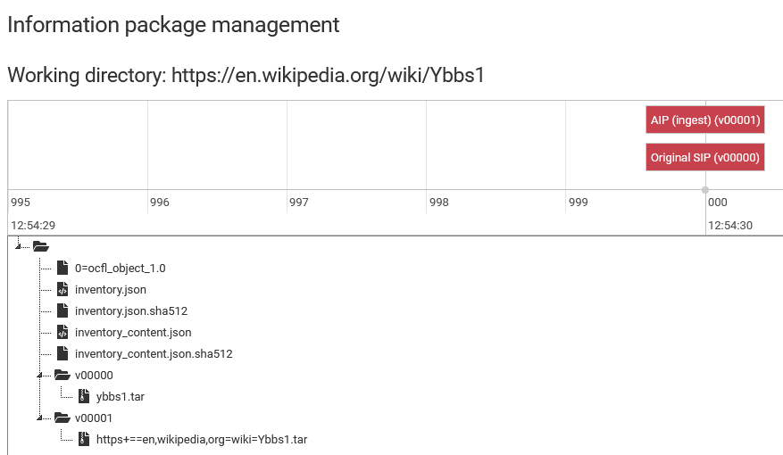
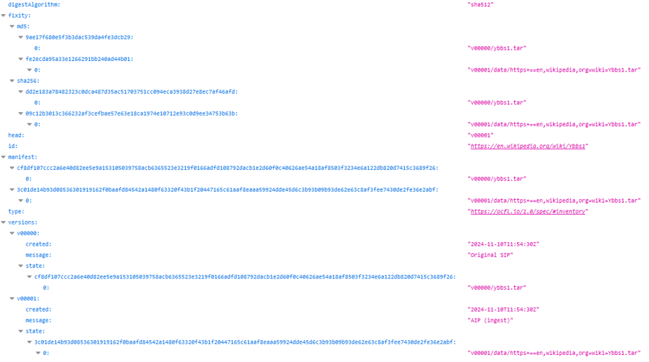
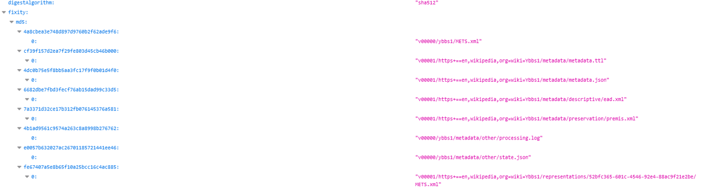

# Agenda 2024-11-11

- Move BagIt to appendix https://github.com/DILCISBoard/E-ARK-AIP/issues/83
- AIP OCFL Implementation (presentation and discussion using demo instance)
- Proposed CSIP issue for identifier mapping: https://github.com/DILCISBoard/E-ARK-CSIP/issues/748
- URNs for content file identification in AIPs

# Move BagIt to appendix

- The BagIt recommendation for packaging will be removed to a CSIP appendix
- Decided in DILCIS
- Implementation to be done

# AIP OCFL Implementation




# AIP OCFL Implementation - Package OCFL




# AIP OCFL Implementation - Content OCFL




# URNs for content file identification in AIPs

One possible implementation to open the discussion:

- Namespace
  ```
  urn:e-ark-foundation.eu
  ```
- Repository/Environment Identifier:
  ```
  demo
  ```
- Encoded Package ID (https://zenodo.org/records/11366512)
  ```
  https%3A%2F%2Fzenodo.org%2Frecords%2F11366512
  ```
- Representation ID (UUI)
  ```
  251a157d-bcec-46c9-bfa5-752627fcc0b9
  ```
- File Path
  ```
  2024_05_16_YbbserWerkstatt_01.wav
  ```

  ```
  urn:e-ark-foundation.eu:demo:https%3A%2F%2Fzenodo.org%2Frecords%2F11366512:251a157d-bcec-46c9-bfa5-752627fcc0b9:2024_05_16_YbbserWerkstatt_01.wav
  ```

# Notes 2024-11-11

- OCFL proposal for implementation needs to be discussed with Neil Jefferies
- Concerning the options for OCFL, there the following point seems to be relevant: OCFL: 2.1.5 Objects with Many Small Files; Objects that contain a large number of files can pose performance problems if they are stored in a filesystem as-is. Fixity checks, object validation and version creation can require an OCFL client to process all the files in an object which can be time consuming. Additionally, most storage systems have a minimum block size for allocation to files, so a large number of small files can end up occupying a volume of storage significantly larger than the sum of the individual file sizes. In this case, assuming that the majority of the files are relatively static data that is unlikely to change between objects versions, it is sensible to package the static files together in a single, larger file (zip is recommended). This can be parsed to extract individual files if necessary but can significantly improve the efficiency of basic OCFL client and storage operations.
- There has been a similar discussion in the OCFL Github: https://github.com/OCFL/Use-Cases/issues/33 
- Identifiers: Libraries have registered schemes and their established standards, for others, more types of identifier schemes must to be considered, such as ark or an own protocol eark
